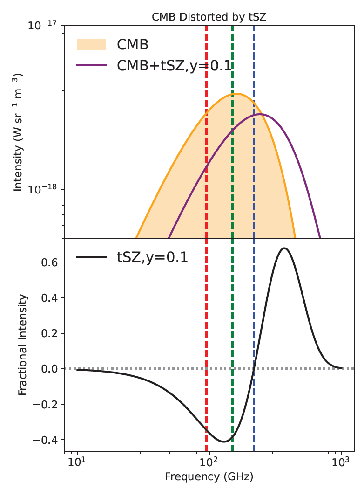
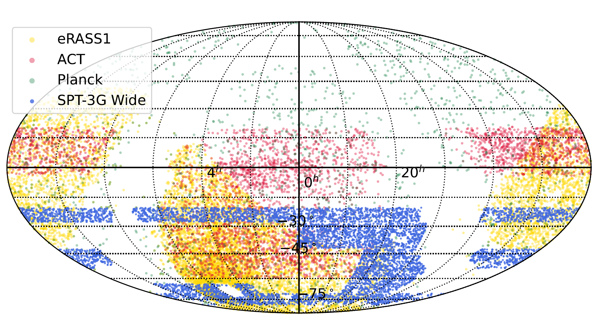
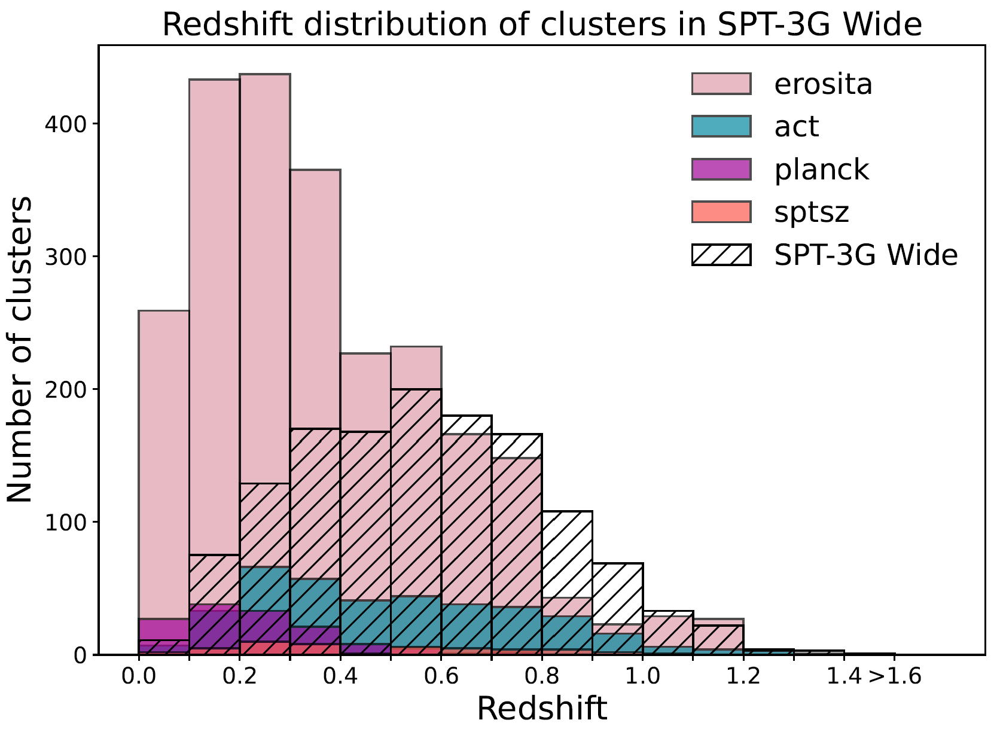
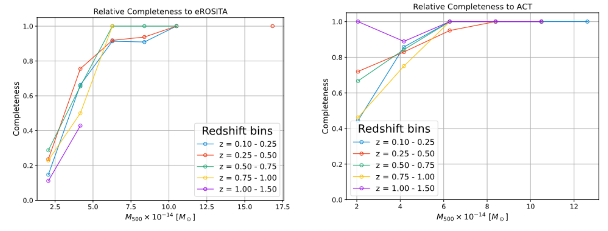

# SPT-3G-Wide-Survey-Preliminary-Galaxy-Cluster-Detection
The South Pole Telescope (SPT) is a 10-meter diameter gregorian telescope with cryogenic millimeter-wavelength receivers. This page summarizes work I did for point sources using data taken by the SPT-3G receiver.

The SPT-3G Wide survey is a 6,000 square-degree extension of the SPT-3G Main and Summer surveys in the Southern hemisphere. The observation campaign ran for most of the 2024 observing season, with the residual observing time dedicated to the Euclid Deep Field-South field (a paper I co-authored [here](https://arxiv.org/abs/2506.00298)).

I analyzed the SPT-3G Wide survey to detect galaxy clusters (see [my data analysis with point sources](https://github.com/ahryciuk/The-SPT-3G-Wide-Survey-Preliminary-Point-Source-Catalog/tree/main)). The survey is broken up into nine fields with the alphabet labels shown below.

  
   
  <em>The SPT-3G Wide survey covers ~6,000 square-degrees of the Southern hemisphere and was observed by the SPT in the 2024 observing season. The survey is broken up into nine individual fields with corresponding alphabet labels. Figure from Hryciuk 2025.</em>

## Problem Statement:
Galaxy clusters are gravitationally-bound collections of galaxies that have formed by aggregating matter throughout the evolution of the universe. They are thought to be bound by a central dark matter halo that accounts for ~85% of their mass. Galaxy clusters directly trace the formation of large-scale structure, and therefore studying how their population has evolved in mass and redshift has a profound impact on the understanding of universal dynamics such as the amplitude of matter fluctuations, the nature of dark energy, and the mass of relativistic species. 

## Galaxy Clusters at Millimeter-Wavelengths:
Galaxy clusters are detectable at millimeter-wavelengths through their hot, ionized intracluster medium (ICM), which up-scatters low-energy Cosmic Microwave Background (CMB) photons that act as a backlight. This effect is called the thermal Sunyaev-Zeldovich effect, and is represented for the South Pole Telescope band centers below.

  
   
  <em>The thermal Sunyaev-Zeldovich effect is the up-scatter of low-energy CMB photons from the hot, ionized plasma of the intracluster medium within galaxy clusters. The effect causes a spectral distortion of the CMB blackbody signature with a null frequency near 217 GHz. The three dashed vertical lines are the frequencies of the SPT-3G band centers. Figure from Hryciuk 2025.</em>

Detection involves careful construction of an optimal filter similar to [my work with point sources](https://github.com/ahryciuk/The-SPT-3G-Wide-Survey-Preliminary-Point-Source-Catalog/tree/main). There are two main differences. First, the spatial profile of galaxy clusters may extend beyond point-like. SPT uses a $\beta$-profile with core sizes ranging from 0.25-arcmin to 3-arcmin in steps of 0.25-arcmin (cite). Second, rather than rely on single-frequency-band detections, the tSZ signal-to-noise is maximized by combining all three frequency bands. The null frequency at ~217 GHz offers great foreground rejection of dusty signals that look like tSZ from galaxy clusters. 

## Summary of Catalog Results:

  
   
  <em>I detected 6,870 galaxy clusters over 5,052 square degrees of sky (1.36 per square degree). The spatial distribution of the SPT-3G Wide preliminary cluster detections overlaid on top of eROSITA, ACT, and Planck catalogs. Figure from Hryciuk 2025.</em>

  
   
  <em>Redshift distribution of the 1,339 galaxy clusters from my catalog that had counterparts in Wen Han et al. 2024. Figure from Hryciuk 2025.</em>

  
   
  <em>Relative completeness of this catalog relative to other notable intracluster medium catalogs. Figure from Hryciuk 2025.</em>

## Bibliography:
- Wen, Z. L., & Han, J. L. 2024, A catalog of 1.58 million clusters of galaxies identified from the DESI Legacy Imaging Surveys. https://arxiv.org/abs/2404.02002
- Hryciuk, Alexander. 2025. “The SPT-3G Wide Survey Galaxy Cluster Catalog and the SPT-3G+ Cryostat Design.” University of Chicago. https://doi.org/10.6082/UCHICAGO.15844.
